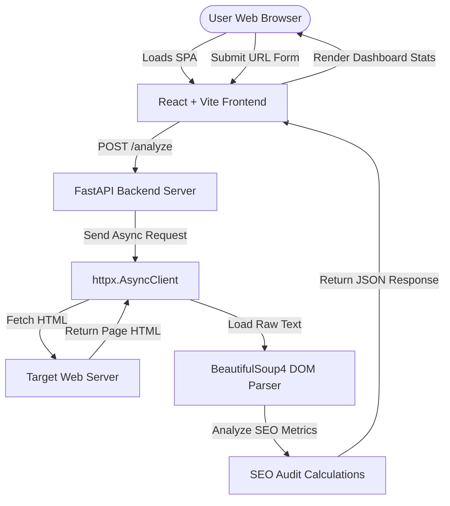

# Architecture Overview

This document describes the high-level architecture of PagePulse, detailing the frontend SPA, backend parser, request lifecycle, and scoring rules.

---

## Architecture Diagram

---

## 1. Frontend Architecture (React Single Page Application)

The client is a responsive, reactive single-page app built with **React** and compiled via **Vite**.

- **State Orchestration**: Managed in `App.tsx`, handling four core states:
  - `idle`: Displays the primary search submission container.
  - `loading`: Plays the diagnostic stepper sequentially.
  - `success`: Renders metrics grids, warning details, and technical notes.
  - `error`: Shows Retry/Return action links.
- **Component Styling**: Set up using **Tailwind CSS** utility tokens for margins, layout grids, borders, custom scrollbar tracks, and moon/sun dark mode toggles.
- **Micro-Animations**: Handled using **Framer Motion** to coordinate transition fading, step loading indicators, card expansions, and progress bar width animations.
- **Animated Value Counters**: `AnimatedNumber.tsx` uses `requestAnimationFrame` to animate count-ups for response times, word counts, H1 headers, and missing ALT text indicators.

---

## 2. Backend Architecture (FastAPI API Web Crawler)

The backend is an asynchronous API server built with Python's **FastAPI**.

- **Non-blocking Coroutines**: Utilizes async routing `async def analyze` to prevent blocking the web thread during network operations.
- **Asynchronous HTTP Engine**: Uses `httpx.AsyncClient` with a safety timeout constraint (15s) and automated redirect follows.
- **HTML Parsing Engine**: Utilizes **BeautifulSoup4** with the fast `lxml` parser to build and traverse the DOM tree without performance penalties.
- **Schema Validation**: Uses **Pydantic v2** models to validate schema parameters, including a custom validator restricting target URLs to `http` or `https` schemes.

---

## 3. Web Request Lifecycle

1. **Initiate Form**: User types `https://example.com` and submits the URL analyzer form.
2. **CORS check**: Browser executes a preflight CORS handshake with the FastAPI endpoint.
3. **Route validation**: FastAPI receives the URL and validates it against the `AnalyzeRequest` model.
4. **HTML Request**: `httpx.AsyncClient` initiates an HTTP request to the target site using a custom user agent `PagePulse-Auditor/1.0.0`.
5. **DOM Processing**: On successful fetch, the HTML text is parsed via BeautifulSoup to count images, headers, and body words.
6. **Rule Evaluation**: The metrics dictionary is evaluated through backend audit rules, subtracting base points to determine the final score.
7. **Response & Render**: The final JSON audit details are sent to the client, triggering animations on the dashboard.

---

## 4. Health Score Calculation

Scoring checks evaluate page structure and compliance:
- **Baseline score starts at 10**.
- **Point Deductions**:
  - **No Page Title**: `-2 points`
  - **No Meta Description**: `-2 points`
  - **Zero H1 Headers**: `-2 points`
  - **Missing Image ALT Attribute**: `-2 points` (deducted if one or more `` tags lack alt text)
  - **Word Count < 300 Words**: `-2 points` (low content volume)
- **Minimum Score Boundary**: Clamped to a minimum score of `0`.
- **UI Scaling**: The frontend automatically scales scores $\leq 10$ by multiplying them by 10, translating them to a standard 0–100 percentage layout.
